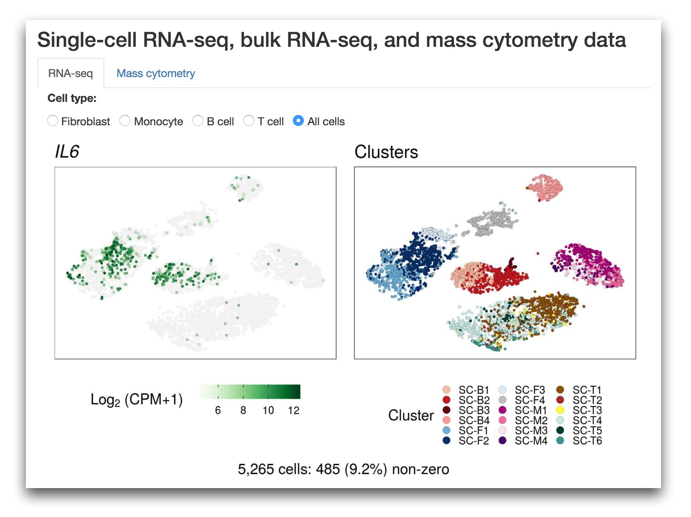

# amp_phase1_ra_viewer 

An app for viewing single-cell RNA-seq and mass cytometry data in synovial tissues from RA and OA patients.

## :rocket: Explore the data

  <b>https://immunogenomics.io/ampra</b>
  

## :mortar_board: Read the paper

**Defining Inflammatory Cell States in Rheumatoid Arthritis Joint Synovial Tissues by Integrating Single-cell Transcriptomics and Mass Cytometry**

Fan Zhang, Kevin Wei, Kamil Slowikowski, Chamith Y. Fonseka, Deepak A. Rao, Stephen Kelly, Susan M. Goodman, Darren Tabechian, Laura B. Hughes, Karen Salomon-Escoto, Gerald F. M. Watts, William Apruzzese, David J. Lieb, David L. Boyle, Arthur M. Mandelin II, Accelerating Medicines Partnership: RA Phase 1, AMP RA/SLE, Brendan F. Boyce, Edward DiCarlo, Ellen M. Gravallese, Peter K. Gregersen, Larry Moreland, Gary S. Firestein, Nir Hacohen, Chad Nusbaum, James A. Lederer, Harris Perlman, Costantino Pitzalis, Andrew Filer, V. Michael Holers, Vivian P. Bykerk, Laura T. Donlin, Jennifer H. Anolik, Michael B. Brenner, Soumya Raychaudhuri

*bioRxiv* 2018. https://doi.org/10.1101/351130

## :floppy_disk: Get the data

Download the data from ImmPort:

<ul>
<li><a href="http://www.immport.org/immport-open/public/study/study/displayStudyDetail/SDY998">SDY998:
AMP Rheumatoid Arthritis Arthroplasty Phase 1</a></li>
<li><a href="http://www.immport.org/immport-open/public/study/study/displayStudyDetail/SDY999">SDY999:
AMP Rheumatoid Arthritis Synovial Phase 1</a></li>
</ul>

## :octocat: Get the code

Get the code for the analysis in the paper:

- https://github.com/immunogenomics/amp_phase1_ra

Get the code for the data viewer:

- https://github.com/immunogenomics/amp_phase1_ra_viewer
